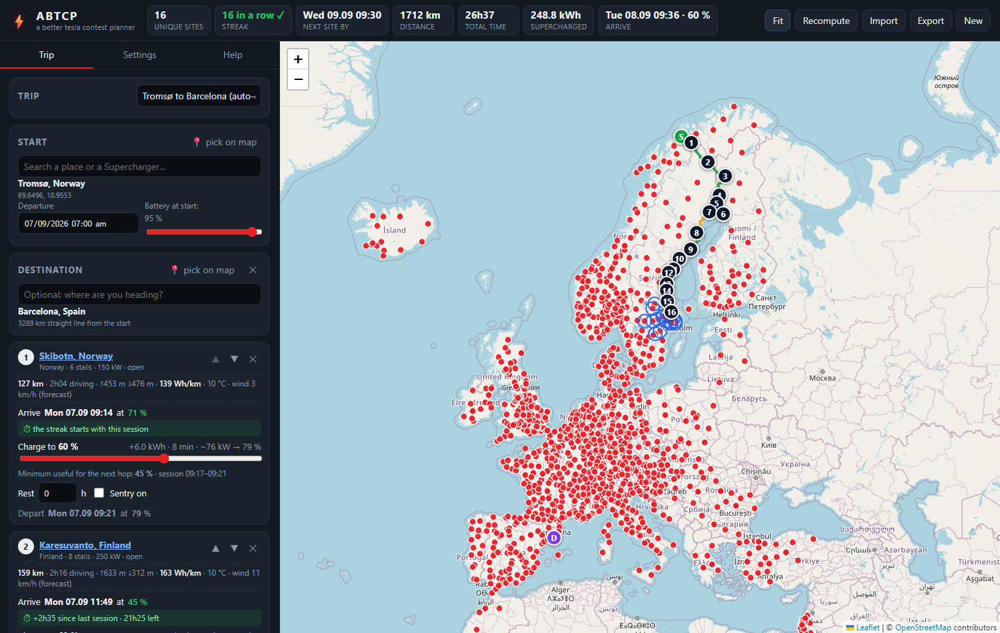

# ABTCP — A Better Tesla Contest Planner

A static web app (GitHub Pages, no backend) to plan road trips that chain **as many unique
Tesla Supercharger sites as possible** for Tesla's
[2026 Free Supercharging Competition](https://www.tesla.com/support/tesla-app/charging-badges/contest)
("Longest Trip" category), with a realistic battery model and the 24-hour streak timer
built in.

Where ABRP finds the *fewest* stops, this is a **de-optimizer**: short hops, small charges,
never below your reserve, never past the deadline.



## The rules it encodes

- **Longest Trip** = longest continuous streak of *unique* Supercharger sites where every new
  site's charging session starts **within 24 h of the previous session's start**.
- Repeat visits are allowed; they neither count nor reset the timer.
- Only Tesla Supercharger sites count (no destination chargers).
- Ties break on total kWh — the header also tracks "supercharged kWh" and unique sites for the year.
- No minimum session size is published; the planner charges **at least +8 %** at every site so a
  session registers (Settings → Contest rules).

Tesla's page blocks automated access, so the rules above were taken from write-ups that quote it.
**Verify them on Tesla's page** — every parameter (window, timer anchor, minimums) is editable.

## Features

- Worldwide charger database (10.9k sites) with status, stalls, power and links to tesla.com.
- Real road routing (OSRM, ferries included) with per-segment speeds from OpenStreetMap limits.
- Physics consumption model: aero + rolling + climbing with regen, heat-pump HVAC by temperature,
  wind along the driving direction, wet-road factor, cold-battery factor, safety margin.
- Elevation from a DEM (Valhalla, smoothed), weather from forecasts (≤ 16 days) or last year's archive.
- Charging curve for the Model Y LR capped by site power (V2 = 150 kW), plug-in overhead, losses.
- Rest / sleep stops with Sentry-mode drain; waypoints with hotel AC charging.
- Per-stop streak timer ("+13h20 since last session · 10h40 left"), header deadline, warnings.
- "Next stop" ranking by road distance with a toward-destination filter (progress measured by
  road distance, so peninsulas that look close are not traps), and greedy
  **Auto-chain** that raises charge targets only as much as the next hop needs.
- Driving profiles (+5 km/h over the limit by default), editable car parameters.
- Everything autosaves in the browser; **Export / Import** the whole plan as one JSON file.

## Use it

Open the GitHub Pages site of this repository (Settings → Pages → *Deploy from a branch* →
`main` / `/ (root)`), or run it locally:

```bash
python -m http.server 8080      # then open http://localhost:8080/
```

1. Set the start (search, map pick or a charger's popup), departure time and battery.
2. Optionally set a destination so candidates are filtered to those that make progress.
3. Add stops from the "Next stop" list or by clicking red dots on the map; set the charge level
   on each card (it shows the minimum useful level for the next hop) and rests where you sleep.
4. Watch the streak timer and the header counters; export the plan when you are happy.

## Refresh the charger database

```bash
python tools/fetch_chargers.py          # downloads supercharge.info → data/chargers.json
```

## Tests

```bash
npm test                                # unit tests (models, services, planner) with node --test
pip install playwright && playwright install chromium
python tests/e2e/test_app.py            # Playwright e2e, offline (fixtures replay OSRM / Open-Meteo)
ABTCP_LIVE=1 python tests/e2e/test_app.py   # + a smoke test against the real services
python tools/capture_fixtures.py        # re-record the OSRM fixtures used by the e2e tests
```

## Data & services (all free, called from the browser)

| What | Service | Notes |
| --- | --- | --- |
| Charger sites | [supercharge.info](https://supercharge.info) | community DB, includes Tesla location ids |
| Routing, distance tables | [OSRM demo server](https://router.project-osrm.org) | fair use; set your own server in Settings for heavy use |
| Elevation | [Valhalla](https://valhalla1.openstreetmap.de) (FOSSGIS OSM demo) | Open-Meteo as fallback |
| Weather | [Open-Meteo](https://open-meteo.com) | no key needed |
| Place search | Photon (komoot), Nominatim | ≤ 1 request/s |
| Map tiles | OpenStreetMap, CARTO | attribution required |

## Trip file

`abtcp-<name>.json` (schema `version: 1`) holds settings, car, driving profile, start,
destination, stops (`charge`, `rest`, `note`), the cached routes (`legs`, compact chunk arrays
with elevation and the weather used) and the list of sites visited earlier in the year. Older or
partial files are deep-merged with defaults on import.

## Layout

```
index.html, app/          the app (ES modules, no build step)
app/model/                pure models: energy, charging, timeline (streak), geo
app/services/             OSRM, Open-Meteo, Photon wrappers
data/chargers.json        generated charger DB
tools/                    fetch_chargers.py, capture_fixtures.py
tests/unit, tests/e2e     node --test and Playwright
docs/superpowers/         design spec and implementation plan
```

Not affiliated with Tesla. Drive safely; the model is an estimate — keep a reserve.
